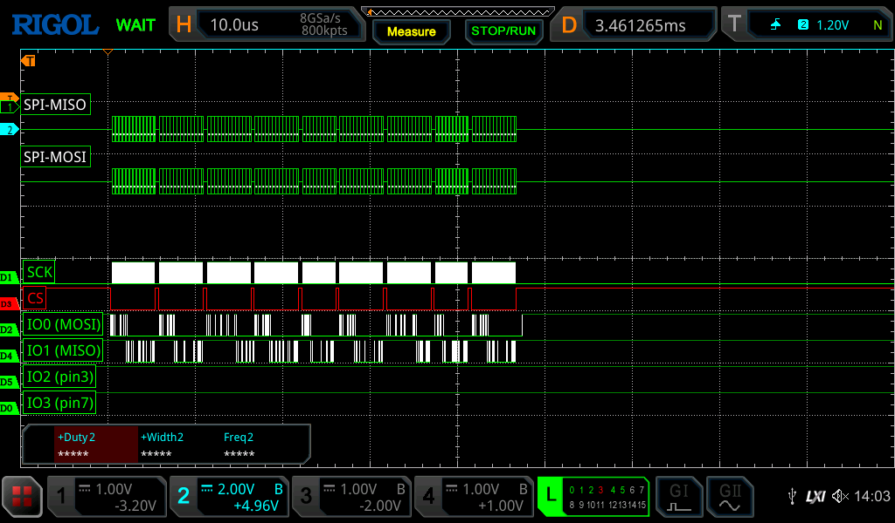
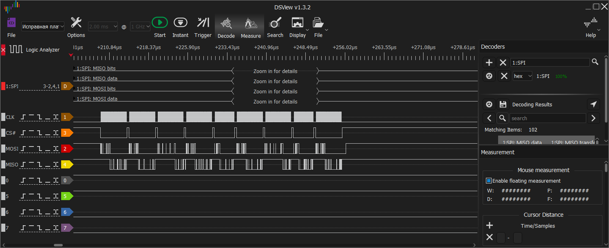
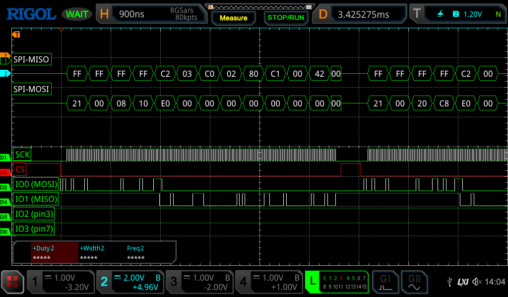
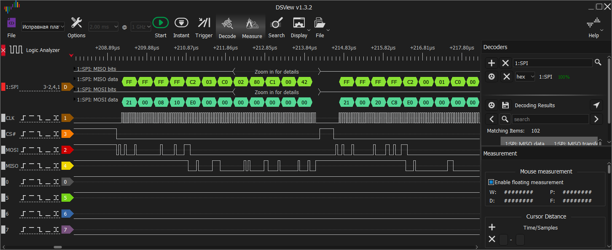

### RU [EN](#EN)

Осциллографы Rigol — это подарок для радиолюбителей и инженеров, поскольку не одно поколение приборов можно проапгрейдить абсолютно бесплатно. Думаю, это специальный маркетинговый ход, а не оплошность.
В серии MSO5000 возможности апгрейда вообще колоссальные — покупаете самый дешевый прибор с двумя каналами и апгрейдите его до 4-х канального + логический анализатор и разные программные дополнения. Кто не знает как возможно увеличение каналов — даже в самом дешевом приборе все компоненты распаяны (разъемы BNC каналов 3 и 4 закрыты крышечками) и при разблокировке опции 4CH эти каналы начинают работать.

  
Предыстория или просто нудятина от автора

Лично я пустил слюну когда узнал об этом приборе в уже далёком 2019-м. Но для ремонта потребительской электроники — моего основного направления деятельности — почти всегда  хватало прибора попроще. Поэтому хорошенько поразмыслив и взвесив все ЗА и ПРОТИВ я отложил эту идею. А потом всё же купил — ну никак хотелка не отпускала 😀.
Первым делом я, конечно же, пропатчил аппарат и довольный 4-я каналами начал смотреть в строну встроенного логического анализатора. Этот тип прибора был тоже желанным еще с тех пор когда я учился в универе и баловался микроконтроллерами. У меня, конечно же, был простенький USB-анализатор, но он годился только для чего-то очень медленного т. к. не обладал ни памятью ни скоростью. А тут почти бесплатно достаточно мощное устройство (в сравнении с тем что у меня было). Почти - потому что логическим анализатором так просто не воспользоваться, нужна специальная приставка, которая будет преобразовывать логические уровни исследуемой схемы в подходящие для осциллографа и отдавать их по дифференциальной паре. К счастью и здесь энтузиасты разработали несколько  вариантов DIY-приставок: от клонов оригинальной PLA2216 (на той же компонентной базе), к более бюджетным и на доступных компонентах. Я воспользовался наработками товарища с ником Gandalf_Sr, но поскольку задач ни для быстрого осциллографа ни, тем более, для логического анализатора у меня нет, это был проектик "выходного дня". Неспешно заказал компоненты, предварительно обдумав внешний вид и эргономику, нарисовал и заказал платы, так же неспешно спаял и еще более неспешно собрал в корпуса (попутно немного разобрался с хоббийной ЧПУ-шкой и подготовкой управляющих программ). А потом сложил это в коробочку в ожидании подходящего  часа.
В коробочке приставка пролежала не долго — неожиданно для себя вступил в закрытое  коммьюнити, участники которого активно внедряют логический анализатор в арсенал оборудования для диагностики при ремонте ноутбуков. Если это читает главный зачинщик Дима JN, то тебе большущий привет и спасибо!
Так я начал изучать уже наработанную информацию и понемногу проверять её в своих случаях. И вот здесь меня ждало очень сильное разочарование...

Как показала практика пользоваться логическим анализатором непосредственно на осциллографе очень неудобно, да и встроенные декодеры протоколов (я пользовался I2C, SPI и Parallel) при любом удобном случае сбоят и не отображают данные.
Воспользоваться найденными в сети просмотровщиками мне не удалось: диаграммы либо не открывались[^1] либо представляли из себя не масштабируемый график.

Программа DSView от [DreamSourceLab](https://www.dreamsourcelab.com/product/dslogic-series/), предназначенная для работы с их USB логическими анализаторами, в плане удобства просмотра и исследования полученных данных тысячекратно превосходит Rigol. А если прибавить к этому возможность написания собственных декодеров (или правки штатных) на Python, то сравнение и вовсе становится бессмысленным.
Дело было за малым — понять как хранятся данные в диаграммах этих типов и преобразовать. В этом очень помогли современные технологии — весь код был сгенерирован ChatGPT, требовалось немного его доработать, чтобы всё работало правильно.

К слову, как подсказывают нервные сети, DSView основан на открытом проекте [sigrok](https://sigrok.org), с модифицированным форматом хранения данных, поэтому желающие могут доработать конвертер под этот просмотровщик.

[^1]: Во время анализа файлов Rigol, созданных на моем осциллографе, я определил форматы заголовков данных. Однако, когда я посмотрел файлы, найденные в сети, я понял причину по которой мои файлы не открывались сторонними просмотровщиками. Оказалось, что в моих файлах в заголовке блока данных логического анализатора записаны неправильные параметры кол-ва семплов, размера блока и длительности выборки. В конвертере предусмотрена коррекция таких ошибок.

### EN

> translated by AI

Rigol oscilloscopes are a gift for enthusiasts and engineers, since more than one generation of devices can be upgraded absolutely free of charge. I think this is a special marketing move, not an oversight.

The upgrade capabilities of the MSO5000 series are truly enormous: you buy the cheapest device with two channels and upgrade it to a 4‑channel one, plus add a logic analyser and various software enhancements. For those who don’t know how channel expansion is possible: even the cheapest device has all components soldered in place (BNC connectors for channels 3 and 4 are covered with caps), and when you unlock the 4CH option, these channels start working.

Practice has shown that using a logic analyser directly on an oscilloscope is very inconvenient, and the built‑in protocol decoders (I’ve used I²C, SPI and Parallel) tend to malfunction and fail to display data whenever they get a chance.

I couldn’t make use of the viewers I found online: either the diagrams wouldn’t open[^2], or they appeared as a non‑scalable graph.

The DSView software from [DreamSourceLab](https://www.dreamsourcelab.com/product/dslogic-series/), designed to work with their USB logic analysers, is a thousand times more convenient than Rigol in terms of viewing and analysing the acquired data. And if you add the ability to write custom decoders (or edit the standard ones) in Python, the comparison becomes completely pointless.

All that remained was to figure out how data is stored in these types of diagrams and perform the conversion. Modern technologies were a great help here — the entire code was generated by ChatGPT, and I only needed to fine‑tune it a bit to make everything work properly.

By the way, as AI suggest, DSView is based on the open‑source project [sigrok](https://sigrok.org), with a modified data storage format. Therefore, anyone interested can further develop the converter for this viewer.

[^2]: While analysing Rigol files created on my oscilloscope, I identified the data header formats. However, when I looked at files found online, I understood the reason why my files wouldn’t open in third‑party viewers. It turned out that my files had incorrect parameters in the logic analyser data block header — specifically, wrong values for the number of samples, block size, and sampling duration. The converter includes error correction for such issues.